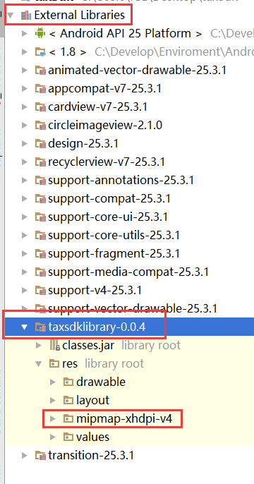

<h1 style="text-align:center">Android SDK 接入指南</h1>

# 1、集成前准备
<a href="https://www.baidu.com">注册并创建应用</a>
# 2、添加依赖
```java
compile ("com.igeshui.sdk.tax:taxsdklibrary:0.0.5", {
    exclude group: "com.android.support"
})
```
# 3、加入权限
```xml
<uses-permission android:name="android.permission.INTERNET" />
<uses-permission android:name="android.permission.READ_EXTERNAL_STORAGE" />
<uses-permission android:name="android.permission.WRITE_EXTERNAL_STORAGE" />
<uses-permission android:name="android.permission.INTERNET" />
<uses-permission android:name="android.permission.ACCESS_NETWORK_STATE" />
<uses-permission android:name="android.permission.ACCESS_WIFI_STATE" />
```


# 4、使用
### 4.1 在Application 的onCreate 方法中进行初始化
```java
TaxLib.getInstance().init(this, new MsgCallback() {
    @Override
    public void loginSuccess(String msg) {
		//个税账户登陆成功返回信息
    }

    @Override
    public void failed(String msg) {
		//发生错误返回信息
    }
});
```
### 4.2 进入sdk前进行授权
apiKey：sdk授权码<br/>
userId：用户唯一标识
```java
TaxLib.getInstance().authorization(apiKey, userId, new AuthorizationCallback() {
    @Override
    public void success() {
        //授权成功
        Toast.makeText(TestActivity.this, "授权成功", Toast.LENGTH_SHORT).show();
    }

    @Override
    public void failed(String msg) {
        //授权失败
        Toast.makeText(TestActivity.this, msg, Toast.LENGTH_SHORT).show();
    }
});
```
### 4.3进入sdk页面（当前城市个税登陆页面）
```java
startActivity(new Intent(TestActivity.this, TaxLoginActivity.class));
```
    或者（进入指定城市个税登陆页面）
```java
startActivity(new Intent(TestActivity.this, TaxLoginActivity.class)
        .putExtra("City","厦门")
        .putExtra("CityId", "350200"));
```
### 4.4颜色
 res下colors文件添加
```xml
 <color name="TaxSdkColor_Primary">#06CFC5</color>
 <color name="TaxSdkColor_Background">#e9e9e9</color>
```
TaxSdkColor_Primary为主题延时<br/>
TaxSdkColor_Background为背景颜色

### 4.5图片资源
 在External Libraries下找到taxsdkLibrary-0.0.4替换res下mipmap中的图片资源<br>
</img>
# 5、APP打包混淆
```java
-keep class com.igeshui.sdk.tax.** {*;}
```
